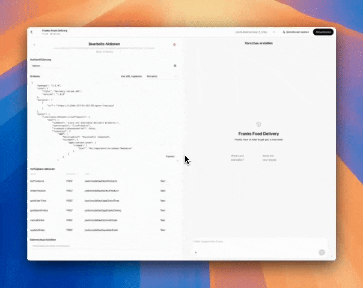

# Open Functions Actions

This repository helps to connect **OpenFunctions** as Actions to Custom GPTs inside ChatGPT. It provides an easy way to serialize **OpenFunctions** to the required OpenAPI schema and includes a controller to receive requests directly from ChatGPT.



## Installation

Install the package via Composer:

```bash
composer require assistant-engine/open-functions-actions
```

## Usage

### Serializing OpenFunction to the OpenAPI Schema

The repository provides the ActionSerializer class that converts your **OpenFunctions** instance into an OpenAPI-compliant specification. This schema is essential for integrating your functions as actions in ChatGPT.

```php
// Instantiate an OpenFunction (e.g., DeliveryOpenFunction).
$deliveryFunction = new DeliveryOpenFunction([
    'Margherita',
    'Pepperoni',
    'Hawaiian',
    'Veggie',
    'BBQ Chicken',
    'Meat Lovers'
]);

// Create an instance of ActionSerializer.
$serializer = new ActionSerializer('Delivery Action API', '1.0.0', 'https://api.example.com', 'default');

// Generate the API spec as an array.
$apiSpecArray = $serializer->serialize($deliveryFunction);

echo $serializer->toJson($deliveryFunction);
```

You can copy the output directly into the *Schema* from you custom GPT.

### Providing the Endpoint for ChatGPT

#### Extend the Abstract Controller

You can create a controller by extending the provided abstract controller and implement the resolveOpenFunction() method. This method should return an instance of your Open Function implementation (for example, the DeliveryOpenFunction).

```php
<?php

namespace App\Http\Controllers;

use AssistantEngine\OpenFunctions\Actions\Http\Controllers\OpenFunctionActionController;
use AssistantEngine\OpenFunctions\Core\Contracts\AbstractOpenFunction;
use AssistantEngine\OpenFunctions\Core\Examples\DeliveryOpenFunction;

class DeliveryActionController extends OpenFunctionActionController
{
    /**
     * Return an instance of the DeliveryOpenFunction.
     *
     * @param string $identifier (default is 'default')
     * @return AbstractOpenFunction
     */
    public function resolveOpenFunction(string $identifier = 'default'): AbstractOpenFunction
    {
        return new DeliveryOpenFunction([
            'Margherita',
            'Pepperoni',
            'Hawaiian',
            'Veggie',
            'BBQ Chicken',
            'Meat Lovers'
        ]);
    }
}
```

#### Register the Route

Next, register a POST route so that the endpoint /actions/{identifier}/{functionName} is reachable. When a request is sent to this endpoint, it will automatically trigger the handleAction() method inherited from the abstract controller.

You can add the following line to your routes file (usually in routes/web.php or routes/api.php):

```php
use App\Http\Controllers\DeliveryActionController;

Route::post('/actions/{identifier}/{functionName}', [DeliveryActionController::class, 'handleAction']);
```

After that you should be able to chat with your **OpenFunctions** like demonstrated in the video.

### Available Open Function Implementations

In addition to creating your own **OpenFunction**, there are several ready-to-use implementations available.
Here’s a quick overview:

- **[Notion](https://github.com/AssistantEngine/open-functions-notion)**: Connects to your Notion workspace and enables functionalities such as listing databases, retrieving pages, and managing content blocks.
- **[GitHub](https://github.com/AssistantEngine/open-functions-github)**: Integrates with GitHub to allow repository operations like listing branches, reading files, and committing changes.
- **[Bitbucket](https://github.com/AssistantEngine/open-functions-bitbucket)**: Provides an interface similar to GitHub’s, enabling you to interact with Bitbucket repositories to list files, read file contents, and commit modifications.
- **[Trello](https://github.com/AssistantEngine/open-functions-trello)**: Enables interactions with Trello boards, lists, and cards, facilitating project management directly within your assistant.
- **[Slack](https://github.com/AssistantEngine/open-functions-slack)**: Seamlessly connects your assistant to Slack and perform actions like listing channels, posting messages, replying to threads, adding reactions, and retrieving channel history and user profiles.
- **[Jira Service Desk](https://github.com/AssistantEngine/open-functions-jira-service-desk)**: Integrates with Jira Service Desk to interact with service requests—enabling you to create, update, and manage requests (cards), list queues, add comments, transition statuses, and manage priorities.

## More Repositories

We’ve created more repositories to make AI integration even simpler and more powerful! Check them out:

- **[Filament Assistant](https://github.com/AssistantEngine/filament-assistant)**: Add conversational AI capabilities directly into Laravel Filament.
- **[Open Functions Core](https://github.com/AssistantEngine/open-functions-core)**: This library provides a set of primitives that simplify LLM calling.

> We are a young startup aiming to make it easy for developers to add AI to their applications. We welcome feedback, questions, comments, and contributions. Feel free to contact us at [contact@assistant-engine.com](mailto:contact@assistant-engine.com).


## Consultancy & Support

Do you need assistance integrating Filament Assistant into your Laravel Filament application, or help setting it up?  
We offer consultancy services to help you get the most out of our package, whether you’re just getting started or looking to optimize an existing setup.

Reach out to us at [contact@assistant-engine.com](mailto:contact@assistant-engine.com).

## Contributing

We welcome contributions from the community! Feel free to submit pull requests, open issues, and help us improve the package.

## License

This project is licensed under the MIT License. Please see [License File](LICENSE.md) for more information.